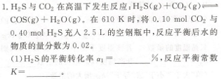
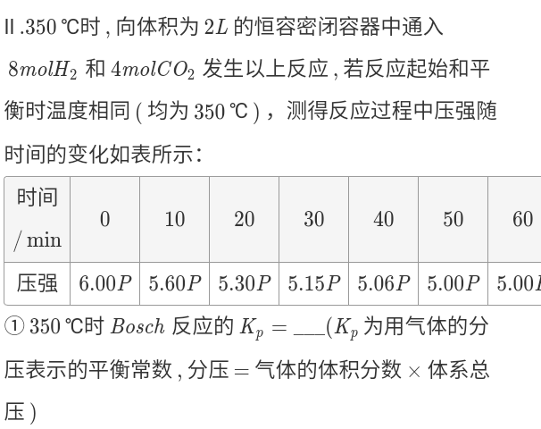
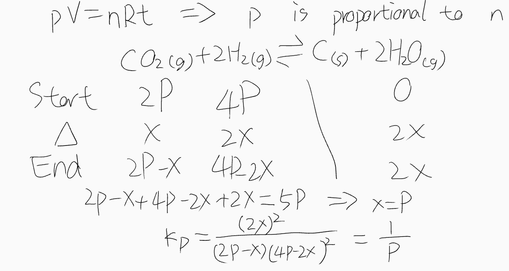

# Chemical equilibrium

## \\( K_c \\)

### Algorithm

+ When the gas coefficients on both sides of the reaction equation are equal, \\( V \\) can be canceled, that is one can use \\( n \\) instead of \\(c \\).

### NCEE

## \\( K_p \\)

### Algorithm

+ Sometimes \\( p \\) is proportional to \\( n \\) (\\(p V = n R t \\))
+ \\( K_p  = \frac{p(C)^c p(D)^d}{p(A)^a p(B)^b} = \frac{(p \cdot x(C))^c (p \cdot x(D))^d}{(p \cdot x(A))^a (p \cdot x(B))^b} = p^{(c + d) - (a + b)} \frac{x(C)^c x(D)^d}{x(A)^a x(B)^b} \\) (\\(x \\) is [Mole fraction](https://web.archive.org/web/20201203101206/https://en.wikipedia.org/wiki/Mole_fraction))

### Constant pressure

#### NCEE

##### 1

