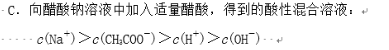

# Conservations in Solutions

## Charge conservation

Sign: no molecule, only ions

[Wikipedia](https://web.archive.org/web/20201221114100/https://en.wikipedia.org/wiki/Charge_conservation)

### NCEE

### Algorithm 1

If \\( c(A^+) + c(B^+) = c(C^-) + c(D^-) \\)

\\( c(A^+) > c(B^-) > c(C^+) > c(D^-) \\) and \\( c(A^+) > c(C^+) > c(B^-) > c(D^-) \\) are false

In other word, The first and last ion must be both positive or both negative.

#### NCEE

## Conservation of Matter

Sign: has ions and molecules; no \\( H^+ \\) \\( OH^- \\)

## Conservation of protons

Sign: has ions and molecules and \\( H^+ \\) and \\( OH^- \\)

## Extra: Concentration comparison

Major forms > Primary hydrolysis products and Primary ionization products > others

### \\( MA : HA = 1 : 1 \\)

Either \\( c(HA) > c(M+) > c(A^-) \\) or \\( c(A^-) > c(M+) > c(HA) \\) is true
