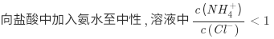

# Conservations in Solutions

## Charge conservation

Sign: no molecule, only ions

[Wikipedia](https://web.archive.org/web/20201221114100/https://en.wikipedia.org/wiki/Charge_conservation)

### NCEE

## Conservation of Matter

Sign: has ions and molecules; no \\( H^+ \\) \\( OH^- \\)

## Conservation of protons

Sign: has ions and molecules and \\( H^+ \\) and \\( OH^- \\)
