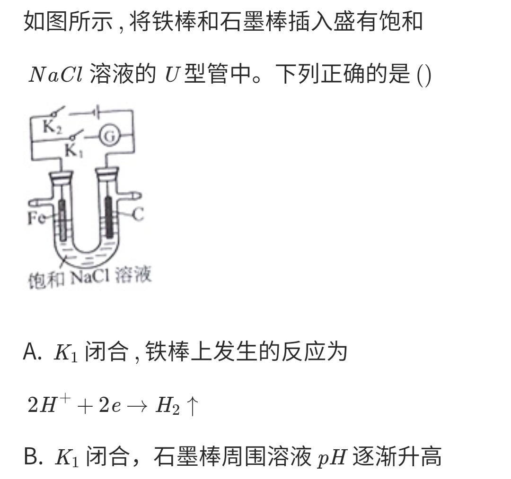
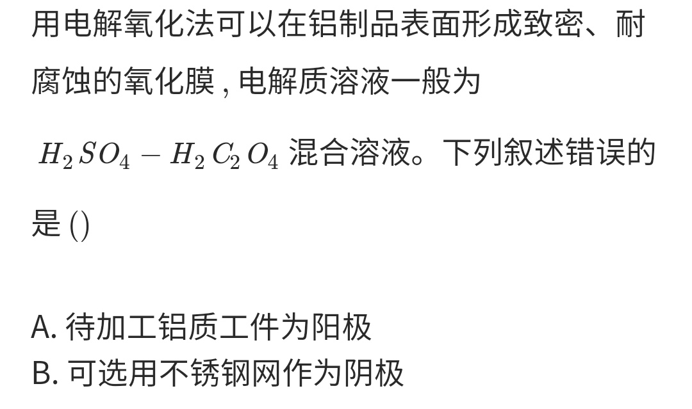

# Primary cell and Electrolytic cell

## Mnemonic

+ The positive electrode and cathode are only responsible for transferring electrons
+ Primary cell
    + Negative oxidation; positive reduction (负氧正还)
    + Positive positive negative negative (正正负负): Positively charged ions flow to the positive electrode, and negatively charged ions flow to the negative electrode.
    + Positive increase; negative decrease (正增负减): The pH of positive electrode increases, and the pH of negative electrode decreases. Requirements: no proton-exchange membrane
    + Negative electrode: Reducing substances For example: metal, \\( H_2 \\)
    + Positive electrode: Oxidizing substances For example: \\( O_2 \\) \\( Cl_2 \\)
+ Electrolytic cell
    + Anode oxidation; cathode reduction (阳氧阴还)
    + The anode is connected to the positive pole, and the cathode is connected to the negative pole
    + Anode: producing oxidizing substances
    + Cathode: producing reducing substances
    + The anode and the cathode attract each other (阴阳相吸): Positively charged ions flow to the cathode, and negatively charged ions flow to the anode.
    + The cathode rise and the anode fall (阴盛阳衰): The pH of the cathode increases, and the pH of the anode decreases. Requirements: no proton-exchange membrane

## NCEE

### Primary cell

### Electrolytic cell

