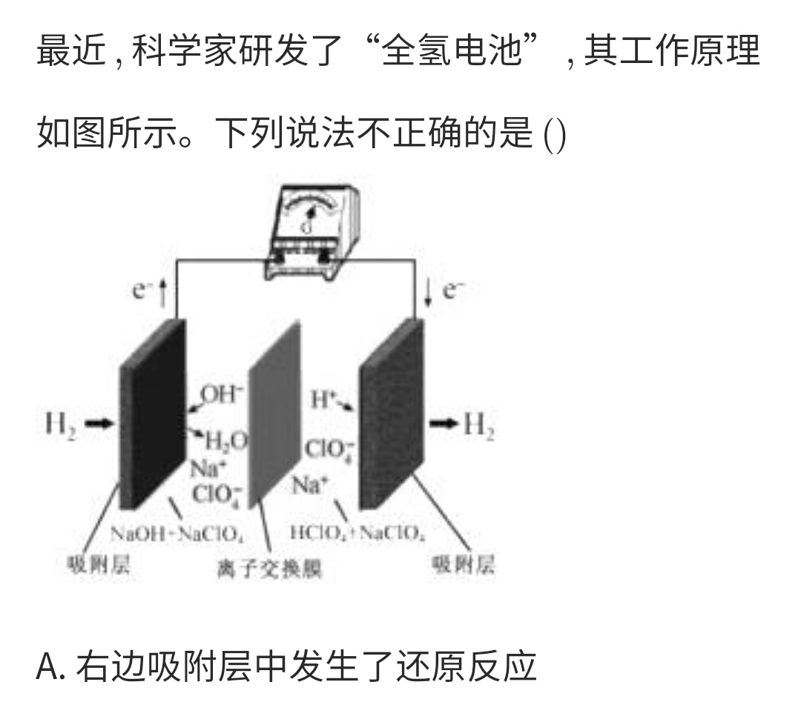
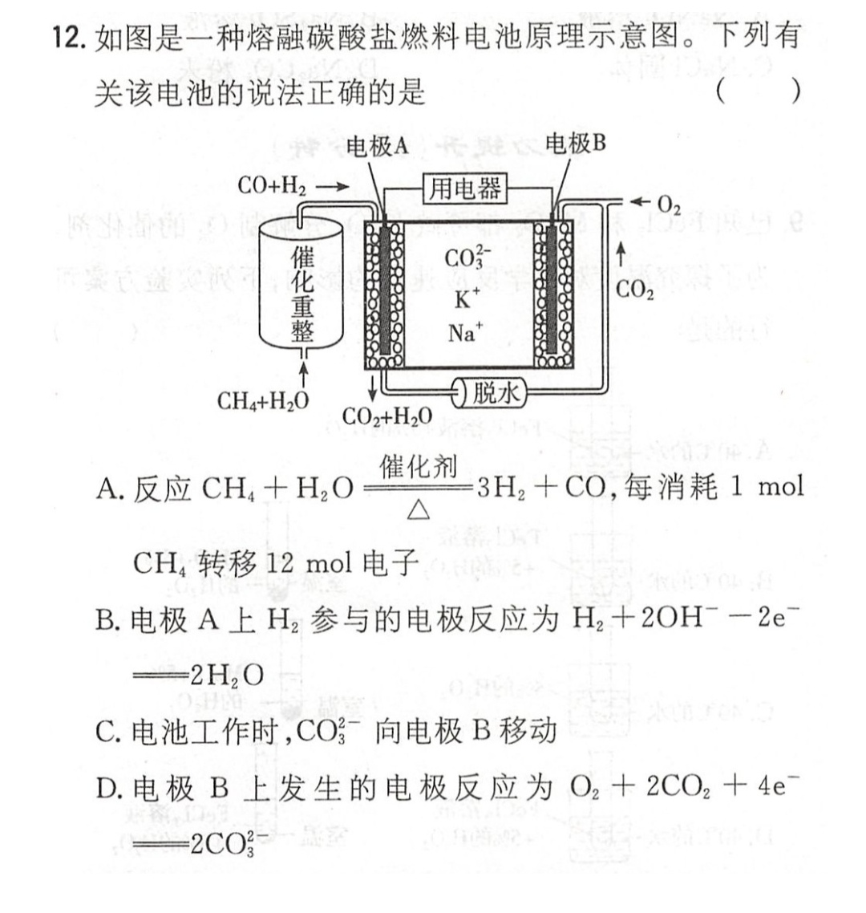

# Primary cell and Electrolytic cell

**Mnemonic**

+ Primary cell (原电池)
    + Negative oxidation; positive reduction (负氧正还)
    + Positive positive negative negative (正正负负): Positively charged ions flow to the positive electrode, and negatively charged ions flow to the negative electrode.
    + Positive increase; negative decrease (正增负减): The pH of positive electrode increases, and the pH of negative electrode decreases.
    + Negative electrode (负极): Reducing substances For example: metal, \\( H_2 \\)
    + Positive electrode (正极): Oxidizing substances For example: \\( O_2 \\)

**NCEE**

