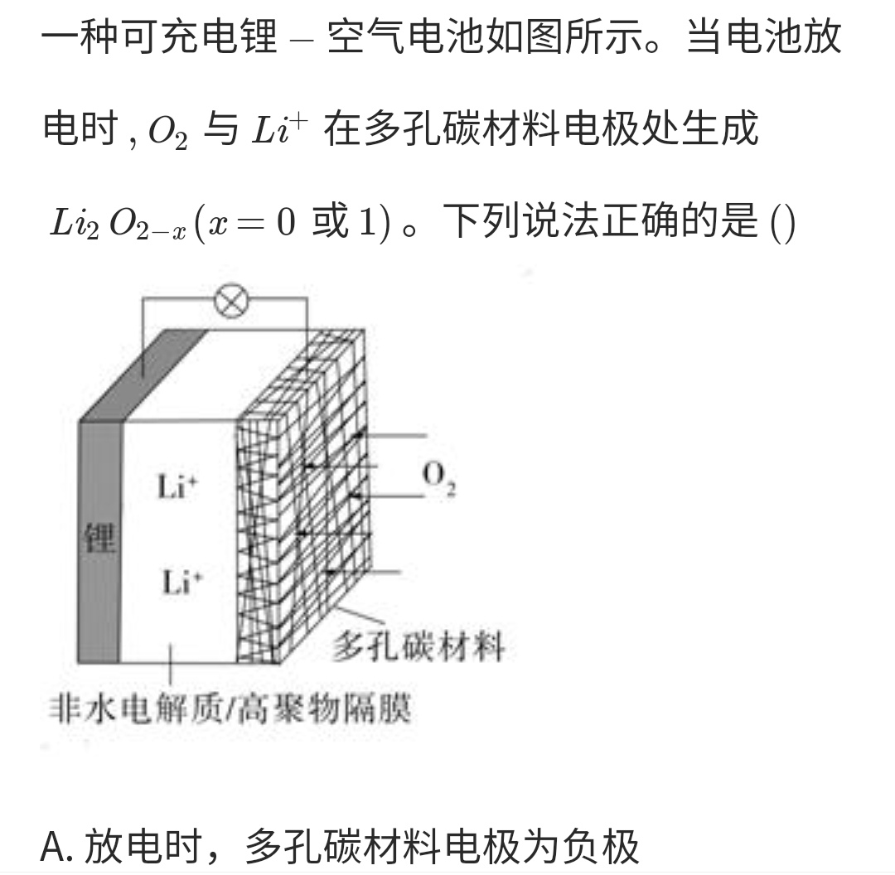

# Primary cell and Electrolytic cell

**Mnemonic**

+ Primary cell (原电池)
    + Negative oxidation; positive reduction 负氧正还
    + Negative electrode (负极): Reducing substances (还原性物质) For example: metal, \\( H_2 \\)
    + Positive electrode (正极): Oxidizing substances (氧化性物质) For example: \\( O_2 \\)

**NCEE**

