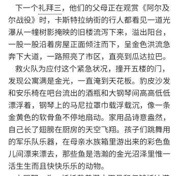
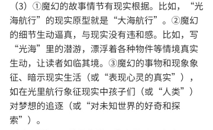
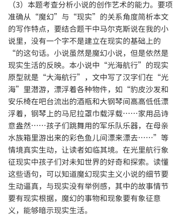
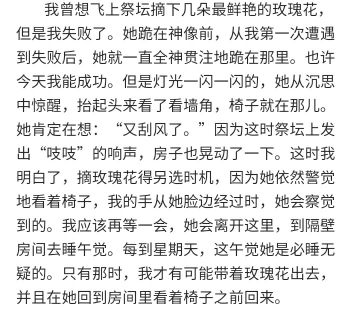
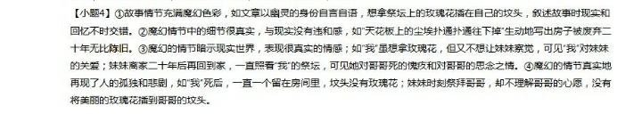
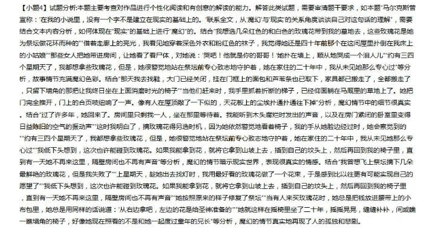

# Novel

## Magic & Reality

Representative Writers: Gabriel García Márquez

### Template

+ The magic storyline has a basis in reality.
+ Magical details are vivid and realistic, with no contradiction to reality.
+ Magical things and phenomena symbols, represents and suggests real life.

### NCEE

#### 1

#### 2

