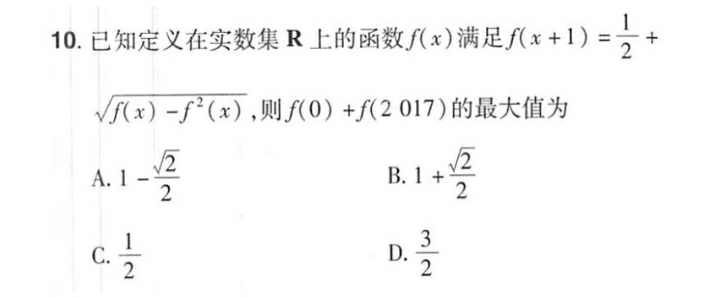

# Function

## Periodic function

### NCEE

#### 2

\\( f(x) = 2ax^2+bx-3a+1 \\) \\( \forall{x} \in \[-4,4\] . f(x) \geq 0 \\) \\( 5a+b \\) min

##### Solution

\\( f(x) = (2x^2-3)a +xb+1 \\)

\\( \frac{2x^2-3}{1} = \frac{5}{1} \\)

......

\\(-\frac{1}{3}\\)
