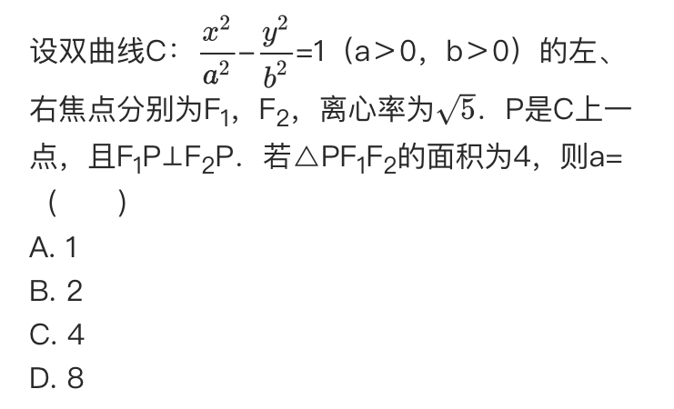

# On A Plane ...

## Line

General Form: \\( A x + B y + C = 0 \\)
Form 1: \\( y = k x + b \\)

### Theorem 1

\\( A x + B y + C \\) have the same sign \\( \iff \\) Points are on the same side

\\( A x + B y + C \\) have the different sign \\( \iff \\) Points are on the different side

#### NCEE

### Theorem 2

If the range of angles is continuous

90 degree is in the range and it is not the endpoint \\( \iff \\) the range of slope is discontinuous

90 degree is in the range \\( \iff \\) there is \\( \infty \\) in the expression of the range of slope

#### NCEE

### NCEE: Parallel; Vertical and Auxiliary Rounding

## Parametric Equation

[Wikipedia](https://web.archive.org/web/20210116104333/https://en.wikipedia.org/wiki/Parametric_equation)

## Procedure: reflect a point across a line

Given

Line \\( Ax+By+C=0 \\)

Point 0 \\( P_0(x_0,y_0) \\)

,

\\(d_2=\frac{Ax_0+By_0+C}{A^2+B^2}\\)

Point 1 \\(x=x_0-2d_2A\\) \\(y=y_0-2d_2B\\)

## Circle

\\((x-a)^2+(y-b)^2=r^2\\)

Tangent:\\((x-a)(x_0-a)+(y-b)(y_0-b)=r^2\\)

Line AB: \\((x-a)(x_0-a)+(y-b)(y_0-b)=r^2\\)

### NCEE

### NCEE: Relations between multiple circles

## Ellipse

Theorem:

\\( S_{\Delta F_1 P F_2} = \frac{1}{2} \left\lvert F_1F_2 \right\rvert \left\lvert y_p \right\rvert = c \left\lvert y_p \right\rvert \\)

\\( S_{\Delta F_1 P F_2} = b^2 tan \frac{\theta}{2} \\)

### Theorem 1

\\(c\in\[sin\frac{\theta}2,1\)\\)

#### NCEE

### Theorem 2

Ellipse/Hyperbola \\(k_{PA}\cdot k_{PB}=e^2-1\\)

Proof: \\(x^2+(\frac{a}{b}y)^2=a^2\\) Regard it as a circle

## Hyperbola

\\( S_{\Delta F_1 P F_2} = b^2 cot \frac{\theta}{2} \\)

### NCEE

## Parabola

### Theorem 1

\\(AB=AF+BF=\frac{2p}{1-cos^2\theta}=\frac{2p}{sin^2\theta}\\)

Ellipse/Hyperbola: \\(AF=\frac{\frac{b^2}a}{1-e\cdot cos\theta}BF=\frac{\frac{b^2}a}{1+e\cdot cos\theta}\\)

Parabola/Ellipse/Hyperbola: \\(AF=\lambda BF\iff \left\lvert e\cdot cos\theta\right\rvert=\left\lvert\frac{\lambda-1}{\lambda+1}\right\rvert\\)

#### Mnemonic

\\(\frac{p}{1\pm\left\lvert cos\theta\right\rvert}\\)
Long minus;short add

#### NCEE

