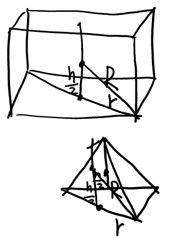
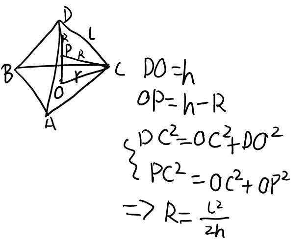
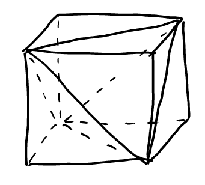
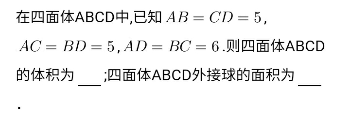

# Solid geometry

## round, sphere

### Algorithm: Radius of circumscribed sphere

#### 1

\\( R^2 = \frac{1}{4} h^2 + r^2 \\)
Proof for example:

#### 2

\\( R = \frac{l^2}{2} \\)
Proof for example:

Mnemonic: 两只老虎

### Tetrahedron

#### Opposite sides are equal

##### NCEE

### Inscribed sphere of a Pyramid

\\( R = \frac{3V}{S} \\)

Regular tetrahedron with edge length \\( a \\): \\( R = \frac{\sqrt{6}}{12} a \\)

[Wikipedia for Tetrahedron](https://web.archive.org/web/20201219035254/https://zh.wikipedia.org/wiki/%E5%86%85%E5%88%87%E7%90%83)
