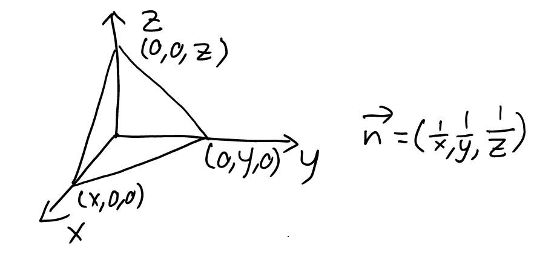
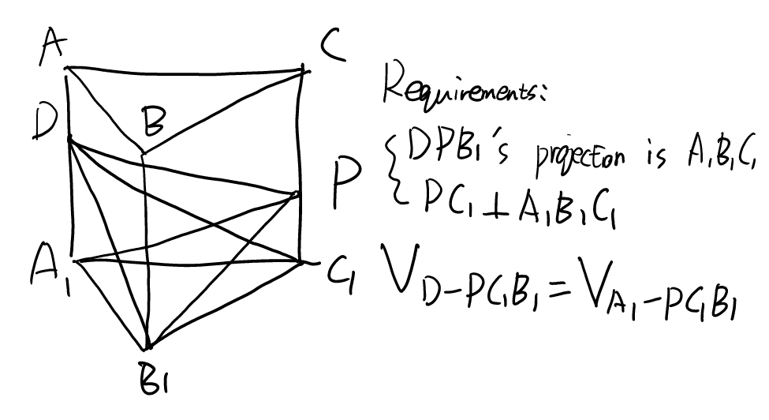
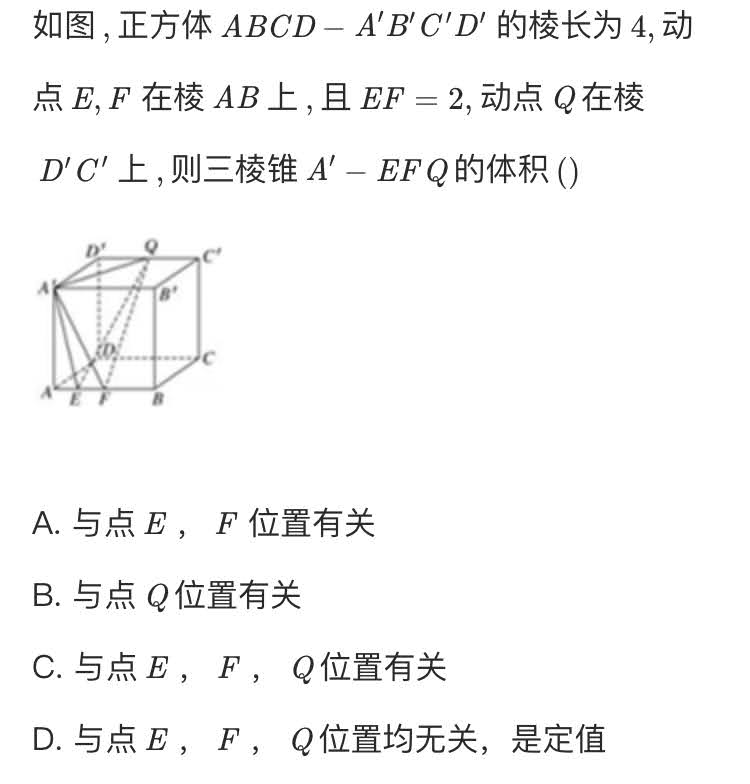
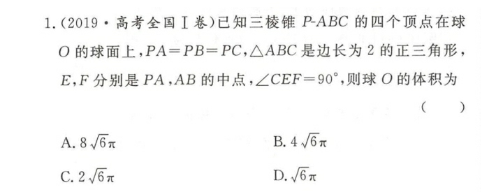

# Solid geometry

## round, sphere

### Procedure: Radius of circumscribed sphere

#### 1

\\( R^2 = \frac{1}{4} h^2 + r^2 \\)
Proof for example:

#### 2

\\( R = \frac{l^2}{2} \\)
Proof for example:

Mnemonic: 两只老虎

### Tetrahedron

#### Opposite sides are equal

##### NCEE

### Inscribed sphere of a Pyramid

\\( R = \frac{3V}{S} \\)

Regular tetrahedron with edge length \\( a \\): \\( R = \frac{\sqrt{6}}{12} a \\)

[Wikipedia for Tetrahedron](https://web.archive.org/web/20201219035254/https://zh.wikipedia.org/wiki/%E5%86%85%E5%88%87%E7%90%83)

## normal vector

### Procedure: intercept

No intersection: For example, \\( n = (0, y, z) \\) if and only if there is no intersection between the plane and the x-axis.

### Procedure: Point-to-Plane Distance

\\( \frac{\vec{v}\vec{n}}{\left\lvert n \right\rvert} \\)

## Procedure: Pyramid Projection

Note: The side edge is perpendicular to the projection surface.

### NCEE

## Theorem 0

(need more study)

\\(sin\alpha=sin\beta\cdot\sin\gamma\\)
\\(\alpha\\) 线面 \\(\beta\\) 锐二面角 \\(\gamma\\) 线与交线夹角

## Statistical Theorem 1

\\(V=\frac{4}{3}\pi R^3\\)

In general, the radius of the ball is regular which means that radius won't be something like \\(\sqrt[3]{\text{...}}\\)

### NCEE

