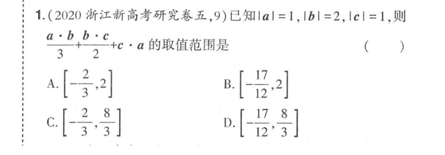

# Some (General?) Methods

## Making up Proportion

[in Inequality](Inequality.md#make-up-proportion)

### 2

\\((x\bar a+y\bar b+z\bar c)^2=...\\)

## Making up function and number sequence

Construct a constant function or a constant number sequence that satisfies the multiple-choice question whenever possible.

## Skip the step of construct \\(g(x)\\)

......+\\(f'(x)\\)+.........\\(<0 \iff\\) \\(g'(x) < 0\\)

## Specific value: 2D -> 1D

Represent the two-dimensional figure described in the multiple-choice question on a one-dimensional line whenever possible.
