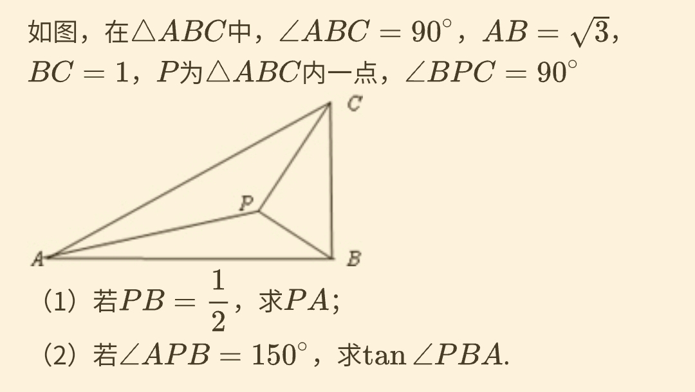

# Trigonometric

## Brocard points

[Wikipedia](http://web.archive.org/web/20210313015312/https://en.wikipedia.org/wiki/Brocard_points)

### NCEE

## 张角定理

[Wikipedia](http://web.archive.org/web/20210313021543/https://zh.wikipedia.org/wiki/%E5%BC%A0%E8%A7%92%E5%AE%9A%E7%90%86)

## Apollonius's theorem

[Baidu](http://web.archive.org/web/20210313024552/https://baike.baidu.com/item/%E4%B8%AD%E7%BA%BF%E5%AE%9A%E7%90%86)
