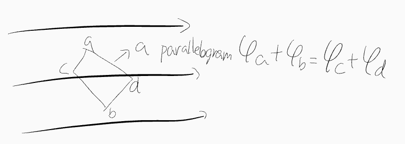
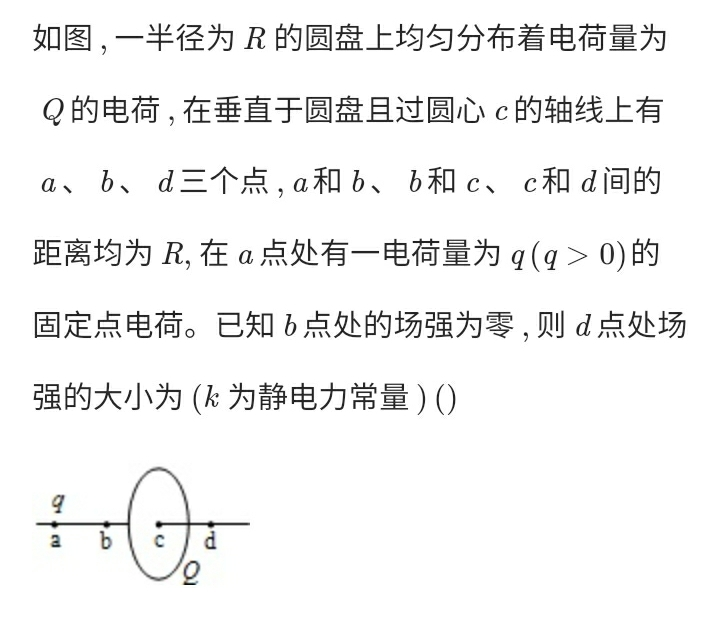
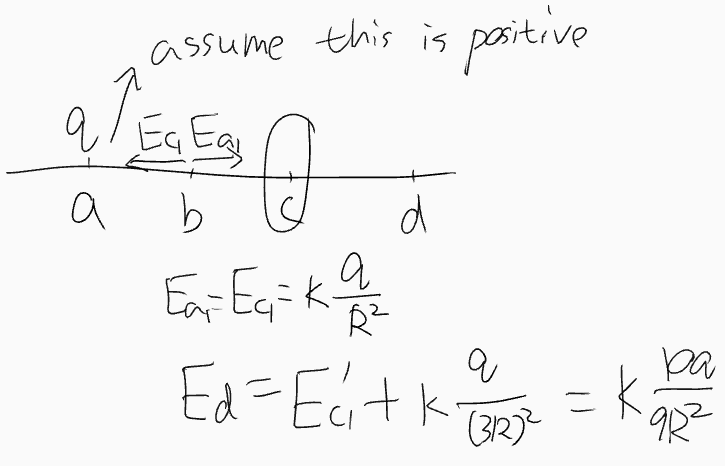
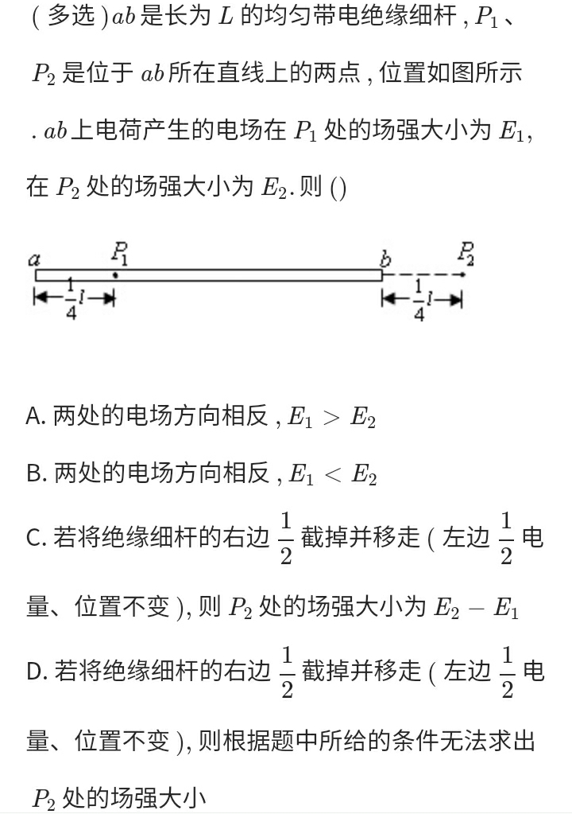
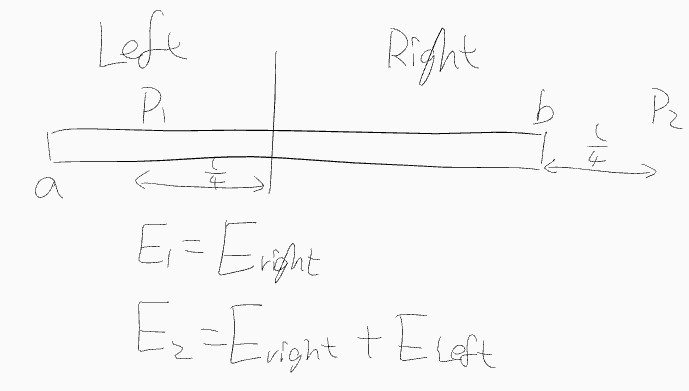
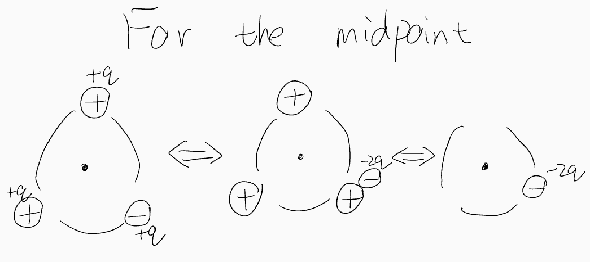

# Eletric

## Eletric Field

### Uniform electric Field

#### Algorithm

+ In a parallelogram ...

### Algorithm: Symmetry

#### NCEE

##### 1

##### 2

### Algorithm 2

## Capacitor

\\( C = \frac{Q}{U} \\)
\\( C = \frac{\epsilon_r S}{4 \pi k d} \\)

\\( E = \frac{U}{d} \\)

### Algorithm: \\( E \propto \frac{Q}{S} \\)

Proof: \\( E = \frac{U}{d} = \frac{Q}{C \cdot d} = \frac{Q}{\frac{\epsilon S}{4 \pi k d} d} = \frac{4 \pi k Q}{\epsilon S} \\)

## Alternating Current

### Algorithm: Equivalent current

+ sine, cosine: \\( I = \frac{I_{max}}{\sqrt{2}} \\)
+ Calculate the average of \\( I^2 \\)

## Algorithm: Dynamic analysis of the circuit with internal resistance

Components connected in series: Inverted ratio
Paralleled: proportional
...
