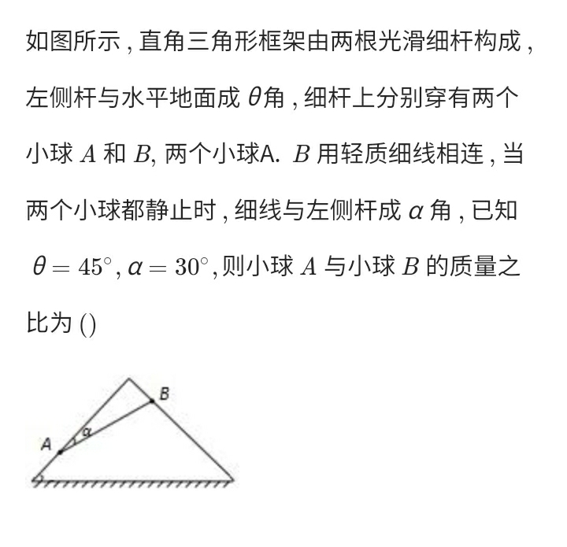

# Force

## Algorithm: Similar triangles

+ Geometric triangles are similar to vector triangles

### NCEE

#### 1

## Algorithm: Deformed Lever

+ Two balls balanced by three forces
+ Have a pair of internal forces (e.g., coulombic forces)
+ Another pair of forces crossed at one point, which is the fulcrum

### NCEE

## Algorithm 3

Requirement: The resultant force of multiple forces is zero

If a force \\( F \\) is reversed, the resultant force after that is \\( 2F \\)
