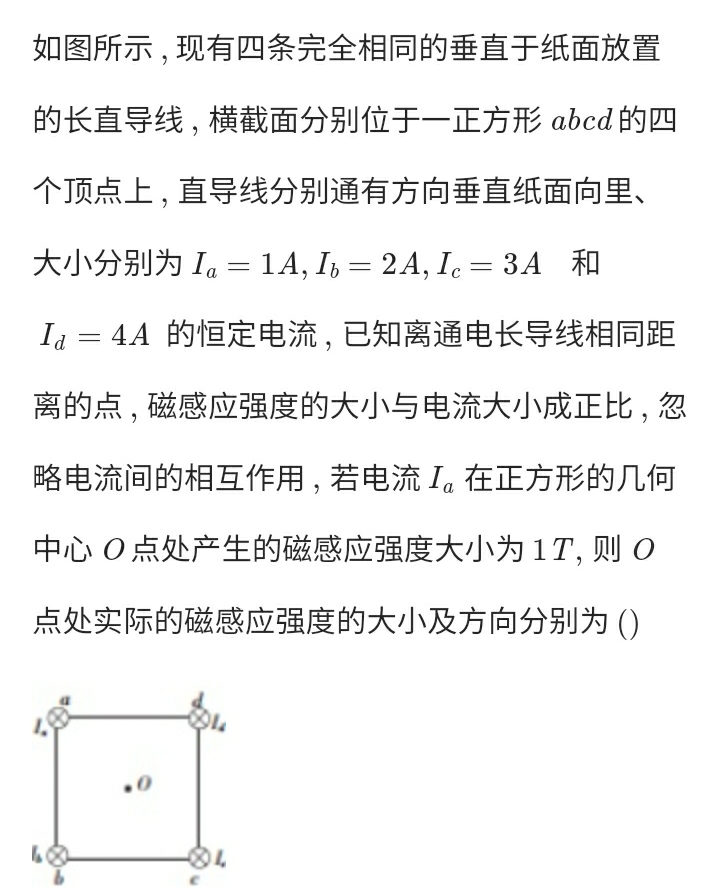
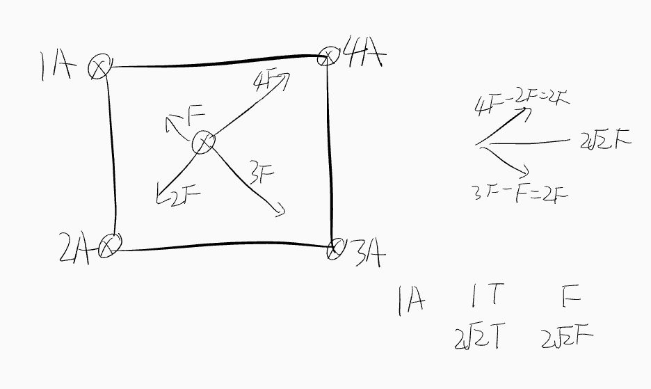
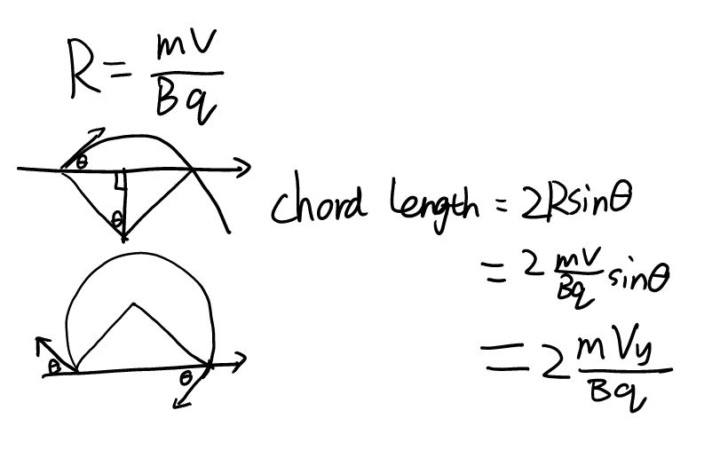
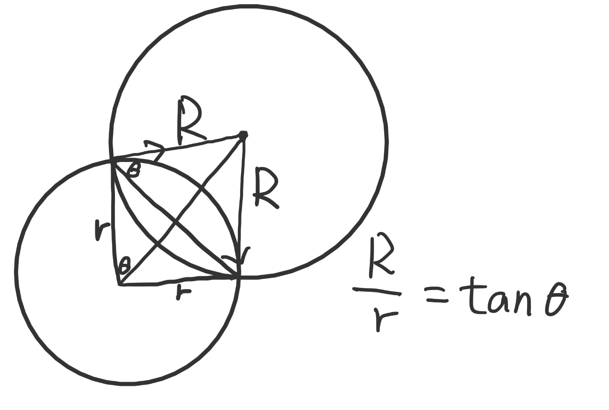
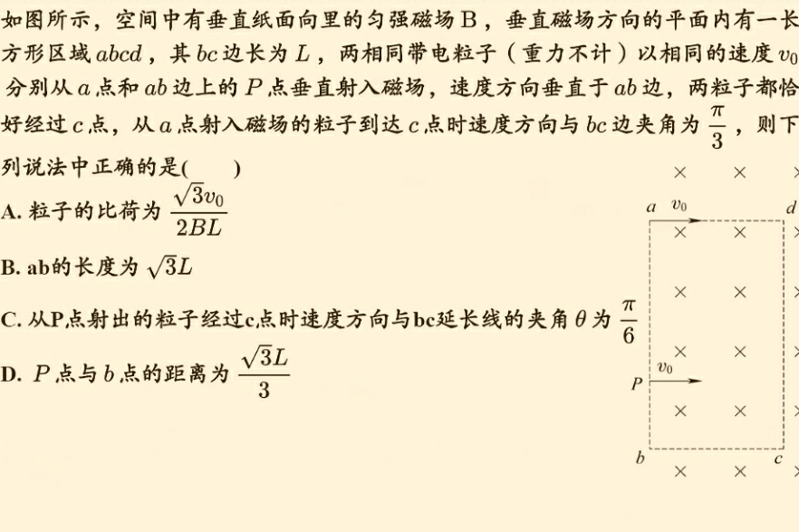

# Magnetic Field

## Procedure: Forces between two currents

> Two wires carrying current in the same direction attract each other, and they repel if the currents are opposite in direction.

[Source](https://web.archive.org/web/20201112020621/http://hyperphysics.phy-astr.gsu.edu/hbase/magnetic/wirfor.html)

## Procedure: Test Electric Current

Used to analyze the strength of the magnetic field generated by multiple currents.

1. Imagine that there is a current at the coordinates to be analyzed
1. Calculate the resultant force
1. Use Left-hand rule to determine the direction of the magnetic field; \\( F \propto B \propto I \\)

### NCEE

#### 1

##### Solution

#### 2

## Circular motion

### 2

If the point of the center of the circle is on the lines of the enter and/or exit velocities

## Procedure: Decompose Lorentz force

[Wikipedia](https://web.archive.org/web/20201223112642/https://en.wikipedia.org/wiki/Lorentz_force)

> \\( F_x = q(E_x + v_y B_z - v_z B_y ) \\)

For NCEE:

\\( q l_x B = \Sigma q v_x B t = m \Delta v_y \\)

\\( q l_y B = \Sigma q v_y B t = m \Delta v_x \\)

### NCEE

