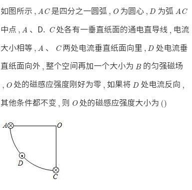

# Magnetic Field

## Algorithm: Forces between two currents

> Two wires carrying current in the same direction attract each other, and they repel if the currents are opposite in direction.

[Source](https://web.archive.org/web/20201112020621/http://hyperphysics.phy-astr.gsu.edu/hbase/magnetic/wirfor.html)

## Algorithm: Test Electric Current

Used to analyze the strength of the magnetic field generated by multiple currents.

1. Imagine that there is a current at the coordinates to be analyzed
1. Calculate the resultant force
1. Use Left-hand rule to determine the direction of the magnetic field; \\( F \propto B \propto I \\)

### NCEE

#### 1

##### Solution

#### 2

