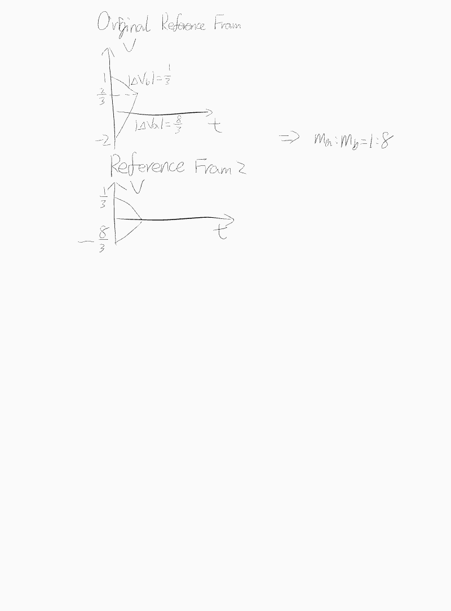

# Momentum

## Perfect Elastic Collision

\\( m_1 v_1 + m_2 v_2 = m_1 v_1' + m_2 v_2' \\)

\\( \frac{1}{2} m_1 v_1^2 + \frac{1}{2} m_2 v_2^2 = \frac{1}{2} m_1 v_1'^2 + \frac{1}{2} m_2 v_2'^2 \\)

### Algorithm
1. \\( v = \frac{m_1 v_1 + m_2 v_2}{m_1 + m_2} \\)
2. \\(v_1\\), \\(v\\) and \\(v_1'\\) form an arithmetic sequence. \\(v_2\\), \\(v\\) and \\(v_2'\\) form another arithmetic sequence. (\\( v - v_1 = v_1' - v \\) and \\( v - v_2 = v_2' - v \\))

## Perfectly inelastic collision

\\( m_1 v_1 + m_2 v_2 = (m_1 + m_2) v' \\)

### Algorithm

+ \\( Q = \frac{1}{2} \frac{m_1 m_2}{m_1 + m_2} (v_1 - v_2)^2 \\) (Available energy, deduced from König's theorem)
+ Use a special reference frame in which total momentum is zero.

## Recoil

Requirements: The total momentum is zero.

### Algorithm

+ Momentum and impulse are equal and opposite.
+ \\( \frac{a_1}{a_2} = \frac{v_1}{v_2} = \frac{x_1}{x_2} = \frac{E_{k1}}{E_{k2}} = \frac{m_2}{m_1} \\)

### Collision multiple times

#### Algorithm
+ For any collision occurring in an isolated system, momentum is conserved.
+ One people throwing a ball at a wall \\( I' = I = (2n - 1) m v \\) ; \\( I' = M v_n \\)
+ Two people throwing a ball at each other \\( I_1 = (2n - 1) m v \\) ; \\( I_2 = 2n m v \\)

#### NCEE

## Inelastic collision

### Algorithm

+ \\( E_{loss} = \frac{1}{2} \frac{m_1 m_2}{m_1 + m_2} (\Delta v_a^2 - \Delta v_b^2) \\) (\\( \Delta v_a \\): Before collision; \\( \Delta v_b \\): After collision)
