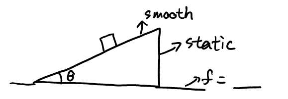
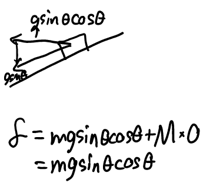

# Movement

## Parabola

Curved motion with constant acceleration

Note: Sometimes the speed cannot decease to 0.

## Algorithm: Newton's second law of The whole system

\\( F_x = m_1 a_1x + m_2 + a_2x + ... \\)

### Exercise

#### 1

#### Solution

